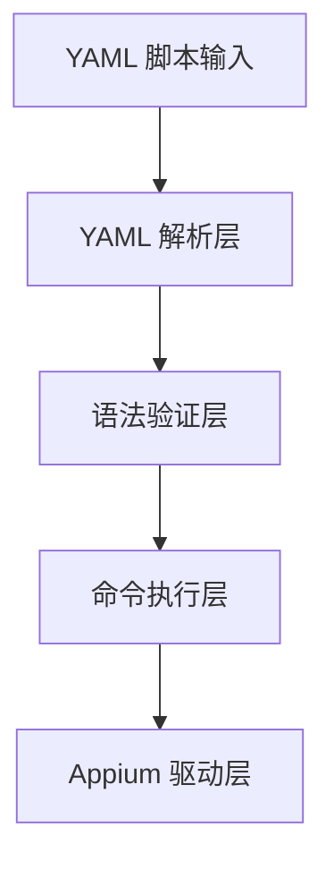
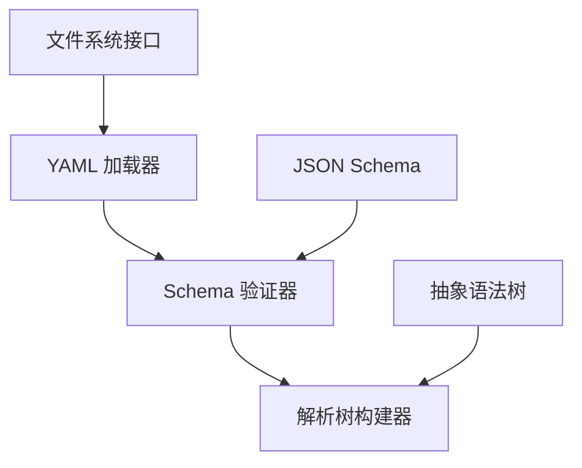
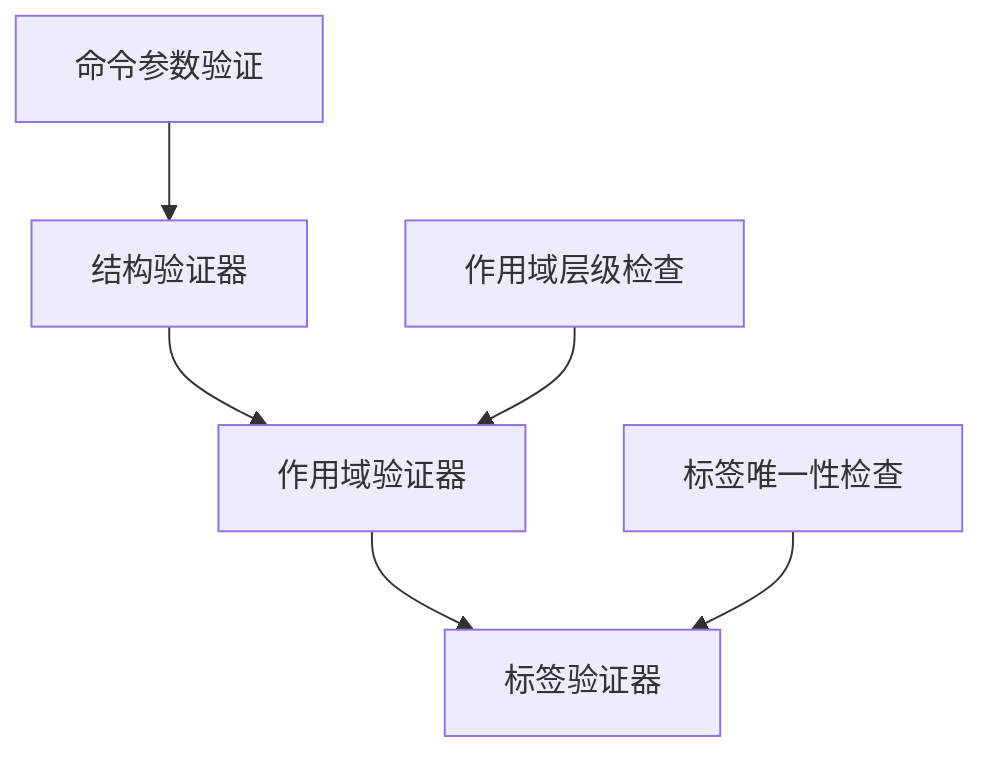
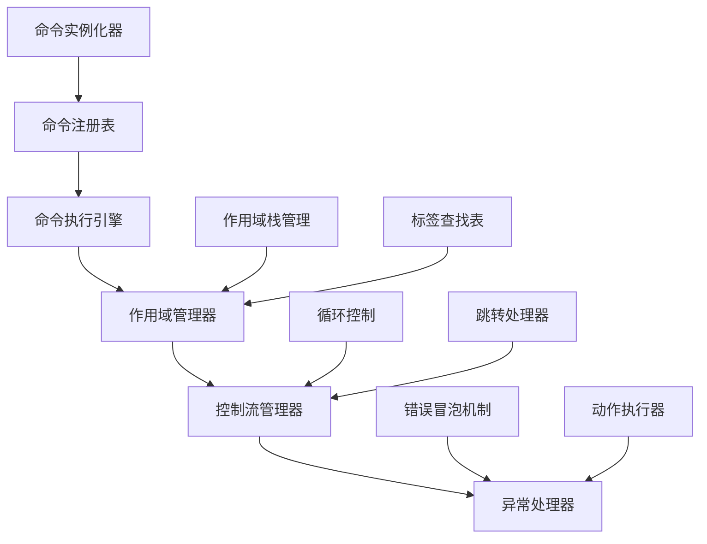
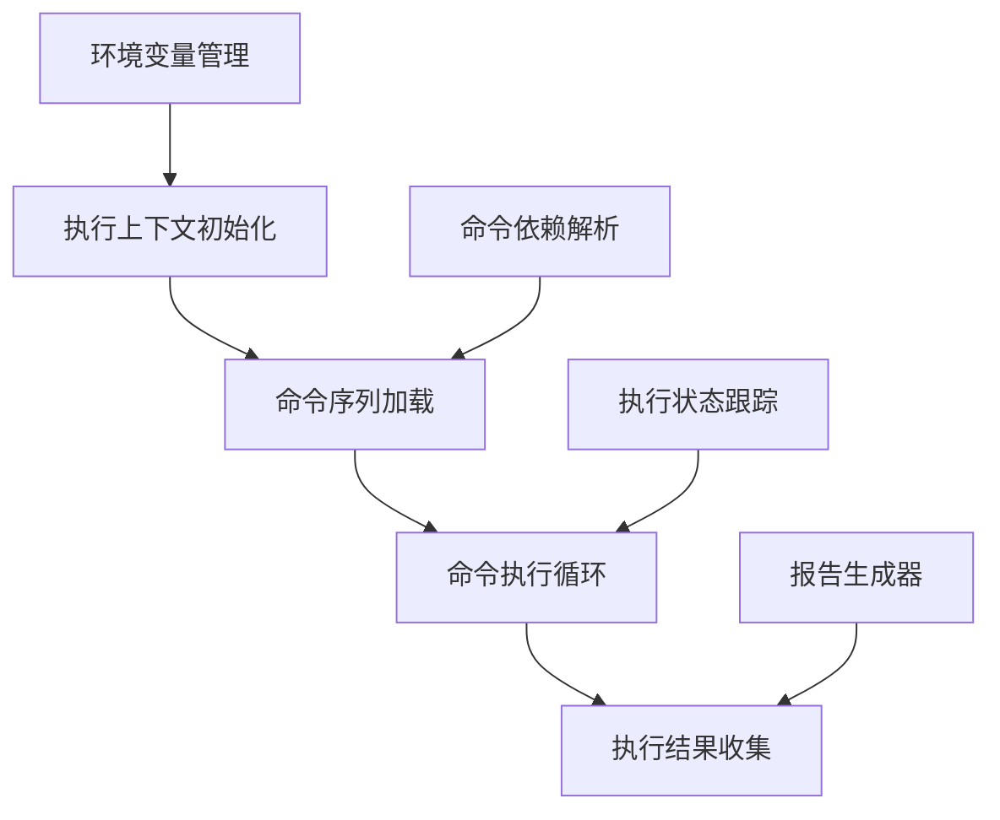
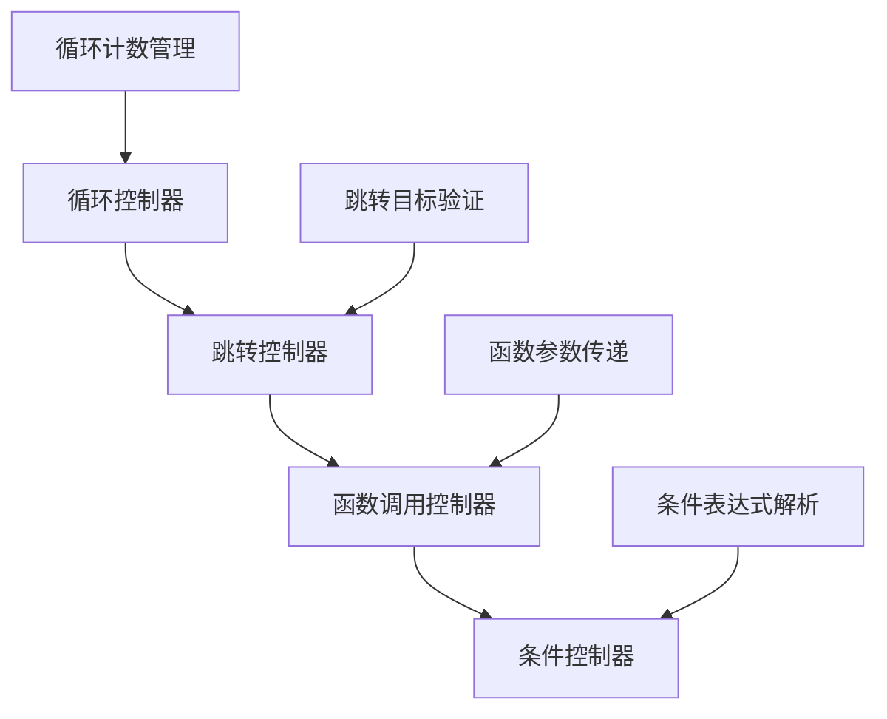
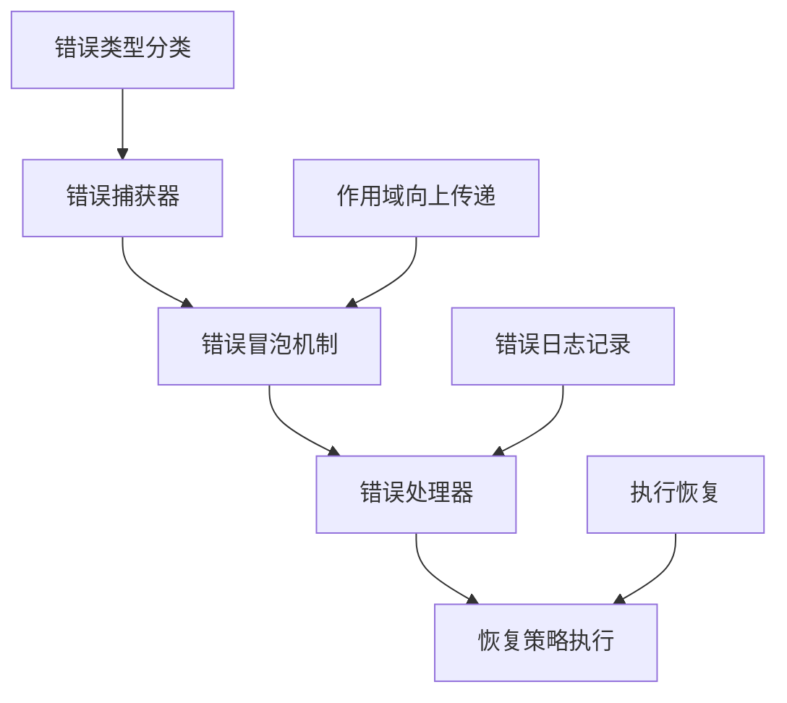
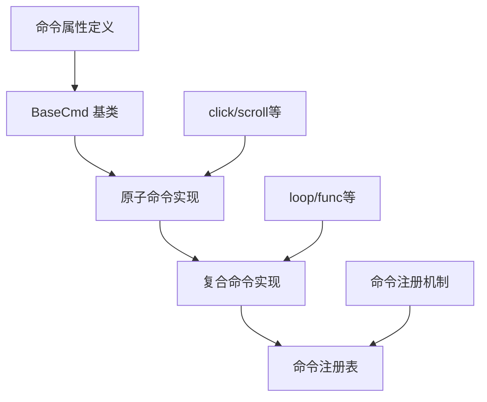
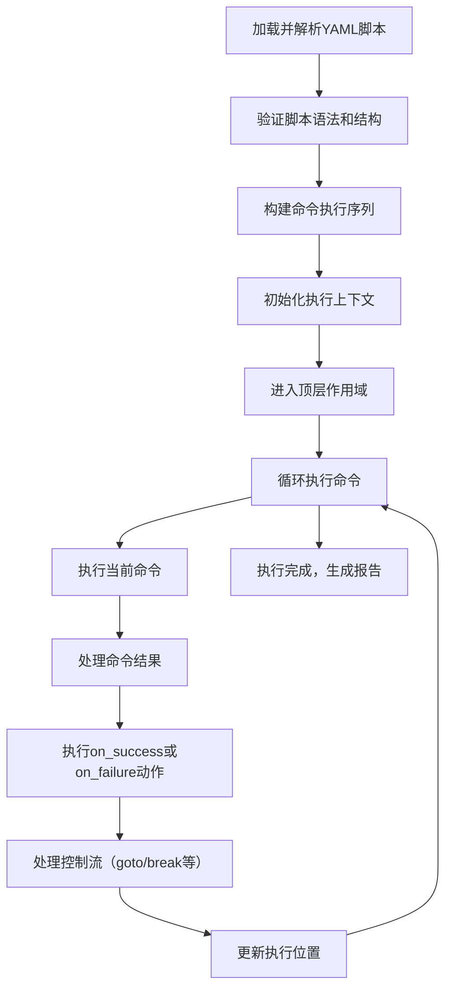

# Velites 自动化测试框架设计图

## 1. 整体架构概览



## 2. 核心模块详细设计

### 2.1 YAML 解析层



#### 2.1.1 YAML 加载器
- 负责从文件或字符串加载YAML内容
- 支持多文件导入机制
- 处理文件编码和格式问题

#### 2.1.2 Schema 验证器
- 使用JSON Schema验证YAML结构的合法性
- 定义命令、函数、循环等结构的格式规范
- 提供详细的验证错误信息

#### 2.1.3 解析树构建器
- 将YAML转换为抽象语法树(AST)
- 构建命令执行的层级结构
- 识别标签、函数、循环等控制流结构

### 2.2 语法验证层



#### 2.2.1 结构验证器
- 验证命令参数的完整性和类型
- 检查控制流结构的正确性
- 确保语法符合DSL规范

#### 2.2.2 作用域验证器
- 检查goto跳转的作用域限制
- 确保标签只在定义的作用域内可见
- 禁止向内层级跳转

#### 2.2.3 标签验证器
- 检查标签的唯一性
- 验证goto的目标标签是否存在
- 确保标签在正确的作用域内定义

### 2.3 命令执行层 (Command Runner)



#### 2.3.1 命令执行引擎



##### 执行上下文初始化
- 创建执行环境
- 初始化Appium客户端连接
- 设置全局配置

##### 命令序列加载
- 从解析树加载命令序列
- 构建命令执行队列
- 解析命令依赖关系

##### 命令执行循环
- 循环执行命令序列
- 处理控制流指令
- 管理执行进度

##### 执行结果收集
- 收集命令执行结果
- 记录执行日志
- 生成执行报告

#### 2.3.2 作用域管理器


##### 作用域栈维护
- 维护当前执行的作用域栈
- 支持作用域的进入和退出
- 记录作用域的层级关系

##### 标签作用域注册
- 在当前作用域注册标签
- 确保标签在作用域内的唯一性
- 维护标签到命令的映射

##### 作用域查找
- 支持向上查找机制（当前作用域 → 父作用域 → 顶级作用域）
- 禁止向下查找（如从外层作用域查找内层func/loop的标签）
- 实现作用域隔离

##### 作用域清理
- 退出作用域时清理资源
- 移除作用域内的标签注册
- 释放作用域相关的执行上下文

#### 2.3.3 控制流管理器



##### 循环控制器
- 管理loop命令的执行
- 维护循环计数和条件
- 处理循环的进入和退出

##### 跳转控制器
- 处理goto命令的执行
- 验证跳转目标的合法性
- 执行跳转操作

##### 函数调用控制器
- 管理func命令的调用
- 处理函数参数的传递
- 维护函数调用栈

##### 条件控制器
- 处理条件判断逻辑
- 解析条件表达式
- 控制执行流程的分支

#### 2.3.4 异常处理器



##### 错误捕获器
- 捕获命令执行过程中的错误
- 分类错误类型
- 记录错误上下文信息

##### 错误冒泡机制
- 支持错误向上冒泡到外层作用域
- 处理on_failure动作
- 控制错误传播的范围

##### 错误处理器
- 执行错误处理逻辑
- 记录错误日志
- 收集错误信息用于报告

##### 恢复策略执行
- 执行on_success或on_failure中定义的恢复策略
- 支持goto、break等恢复动作
- 确保执行流程的稳定性

### 2.4 命令模型层



#### 2.4.1 BaseCmd 基类
```typescript
class BaseCmd {
  name: string;                  // 命令名称
  description: string;           // 命令描述
  params: Record<string, any>;   // 命令参数
  label?: string;                // 命令标签
  on_success?: Action;           // 成功动作
  on_failure?: Action;           // 失败动作
  
  validate(): void;              // 参数验证
  execute(context: ExecutionContext): Promise<void>; // 命令执行
  getScope(): Scope;             // 获取命令所属作用域
}
```

#### 2.4.2 原子命令实现
- **click**: 点击操作
- **scroll**: 滚动操作
- **input**: 输入操作
- **wait**: 等待操作
- **launch_app**: 启动应用
- **close_app**: 关闭应用

#### 2.4.3 复合命令实现
- **loop**: 循环执行
- **func**: 函数定义和调用
- **callfunc**: 函数调用
- **if/else**: 条件执行

## 3. 数据结构设计

### 3.1 ExecutionContext（执行上下文）

```typescript
interface ExecutionContext {
  appiumDriver: any;            // Appium驱动实例
  scopeStack: Scope[];          // 作用域栈
  currentStep: number;          // 当前执行步骤
  executionResult: {
    success: boolean;
    errors: Error[];
    logs: Log[];
  };
  variables: Record<string, any>; // 变量存储
  config: Config;               // 执行配置
}
```

### 3.2 Scope（作用域）

```typescript
interface Scope {
  type: 'top' | 'func' | 'loop';  // 作用域类型
  labels: Map<string, number>;     // 标签映射表（标签名 → 步骤索引）
  parent?: Scope;                  // 父作用域
  name?: string;                   // 作用域名称（如函数名）
  variables: Record<string, any>;  // 作用域变量
}
```

### 3.3 Action（动作）

```typescript
type ActionType = 'goto' | 'break' | 'callfunc' | 'retry';

interface Action {
  action: ActionType;             // 动作类型
  target?: string;                // 目标（如标签名、函数名）
  params?: Record<string, any>;   // 动作参数
}
```

### 3.4 Log（日志）

```typescript
interface Log {
  timestamp: Date;
  level: 'info' | 'warn' | 'error' | 'debug';
  message: string;
  command?: string;
  step?: number;
  context?: Record<string, any>;
}
```

## 4. 执行流程示例



## 5. 扩展性设计

### 5.1 命令扩展机制
- 支持自定义命令的注册
- 提供命令开发接口
- 支持命令的动态加载

### 5.2 报告扩展机制
- 支持自定义报告格式
- 提供报告生成接口
- 支持报告的插件式扩展

### 5.3 驱动扩展机制
- 支持不同类型的移动设备驱动
- 提供驱动适配接口
- 支持多驱动的并行执行

## 6. 性能优化设计

### 6.1 命令执行优化
- 命令的预加载和缓存
- 批量执行优化
- 异步执行支持

### 6.2 内存管理优化
- 作用域的及时清理
- 资源的自动释放
- 内存使用监控

### 6.3 网络优化
- 命令的批量传输
- 网络请求的缓存
- 连接复用机制

## 7. 安全性设计

### 7.1 命令安全验证
- 命令参数的安全验证
- 禁止执行危险操作
- 权限控制机制

### 7.2 数据安全
- 敏感数据的加密存储
- 数据传输的安全通道
- 数据访问的权限控制

### 7.3 执行安全
- 防止无限循环
- 执行超时机制
- 资源使用限制

## 8. 总结

本框架设计提供了一个完整的、可扩展的移动端自动化测试解决方案，具有以下特点：

1. **基于YAML的DSL语言**：简单易用，降低测试脚本编写门槛
2. **严格的作用域管理**：确保goto跳转的安全性和可预测性
3. **强大的命令执行引擎**：支持复杂的控制流和错误处理
4. **良好的扩展性**：支持命令、报告、驱动等的灵活扩展
5. **高性能和安全性**：优化的执行机制和完善的安全措施

该框架可以满足各种移动端自动化测试需求，同时保持执行流程的稳定性和可维护性。